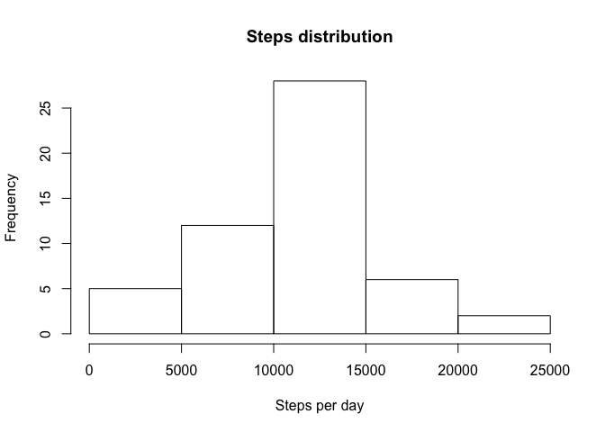
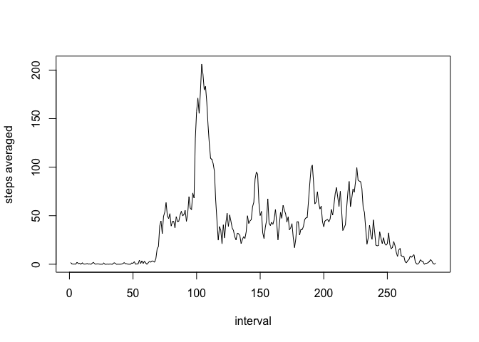
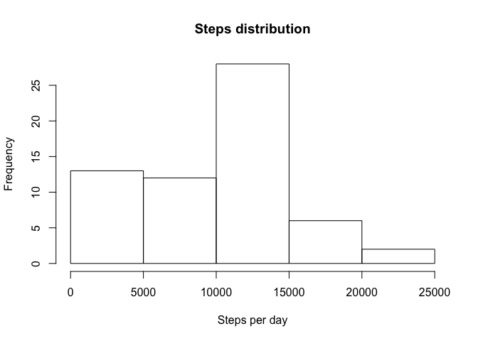

# Reproducible Research: Peer Assessment 1

## Loading and preprocessing the data


```r
## Loading the plyr library
library(plyr)
## Loading the csv file
data <- read.csv(file = "activity.csv", na.strings = "NA", colClasses = c("numeric", "Date", "numeric"))
## Skipping na values in the steps column
activity <- data[!is.na(data$steps),]
```

## What is mean total number of steps taken per day?


```r
## Aggregating steps per date
activity_sum <- ddply(activity, .(date),summarise, sum =sum(steps, na.rm=TRUE), mean = mean(steps, na.rm = TRUE), median = median(steps, na.rm = TRUE))

## Displaying the histogram
hist(x=activity_sum$sum, main = "Steps distribution", xlab = "Steps per day", ylab = "Frequency")
```

\

```r
## Loading xtable to display the table of results
library(xtable)
```

```
## Warning: package 'xtable' was built under R version 3.2.3
```

```r
xt <- xtable(activity_sum[,c("mean","median")])
print(xt, type="html")
```

```
## <!-- html table generated in R 3.2.1 by xtable 1.8-2 package -->
## <!-- Sun Aug 28 13:18:43 2016 -->
## <table border=1>
## <tr> <th>  </th> <th> mean </th> <th> median </th>  </tr>
##   <tr> <td align="right"> 1 </td> <td align="right"> 0.44 </td> <td align="right"> 0.00 </td> </tr>
##   <tr> <td align="right"> 2 </td> <td align="right"> 39.42 </td> <td align="right"> 0.00 </td> </tr>
##   <tr> <td align="right"> 3 </td> <td align="right"> 42.07 </td> <td align="right"> 0.00 </td> </tr>
##   <tr> <td align="right"> 4 </td> <td align="right"> 46.16 </td> <td align="right"> 0.00 </td> </tr>
##   <tr> <td align="right"> 5 </td> <td align="right"> 53.54 </td> <td align="right"> 0.00 </td> </tr>
##   <tr> <td align="right"> 6 </td> <td align="right"> 38.25 </td> <td align="right"> 0.00 </td> </tr>
##   <tr> <td align="right"> 7 </td> <td align="right"> 44.48 </td> <td align="right"> 0.00 </td> </tr>
##   <tr> <td align="right"> 8 </td> <td align="right"> 34.38 </td> <td align="right"> 0.00 </td> </tr>
##   <tr> <td align="right"> 9 </td> <td align="right"> 35.78 </td> <td align="right"> 0.00 </td> </tr>
##   <tr> <td align="right"> 10 </td> <td align="right"> 60.35 </td> <td align="right"> 0.00 </td> </tr>
##   <tr> <td align="right"> 11 </td> <td align="right"> 43.15 </td> <td align="right"> 0.00 </td> </tr>
##   <tr> <td align="right"> 12 </td> <td align="right"> 52.42 </td> <td align="right"> 0.00 </td> </tr>
##   <tr> <td align="right"> 13 </td> <td align="right"> 35.20 </td> <td align="right"> 0.00 </td> </tr>
##   <tr> <td align="right"> 14 </td> <td align="right"> 52.38 </td> <td align="right"> 0.00 </td> </tr>
##   <tr> <td align="right"> 15 </td> <td align="right"> 46.71 </td> <td align="right"> 0.00 </td> </tr>
##   <tr> <td align="right"> 16 </td> <td align="right"> 34.92 </td> <td align="right"> 0.00 </td> </tr>
##   <tr> <td align="right"> 17 </td> <td align="right"> 41.07 </td> <td align="right"> 0.00 </td> </tr>
##   <tr> <td align="right"> 18 </td> <td align="right"> 36.09 </td> <td align="right"> 0.00 </td> </tr>
##   <tr> <td align="right"> 19 </td> <td align="right"> 30.63 </td> <td align="right"> 0.00 </td> </tr>
##   <tr> <td align="right"> 20 </td> <td align="right"> 46.74 </td> <td align="right"> 0.00 </td> </tr>
##   <tr> <td align="right"> 21 </td> <td align="right"> 30.97 </td> <td align="right"> 0.00 </td> </tr>
##   <tr> <td align="right"> 22 </td> <td align="right"> 29.01 </td> <td align="right"> 0.00 </td> </tr>
##   <tr> <td align="right"> 23 </td> <td align="right"> 8.65 </td> <td align="right"> 0.00 </td> </tr>
##   <tr> <td align="right"> 24 </td> <td align="right"> 23.53 </td> <td align="right"> 0.00 </td> </tr>
##   <tr> <td align="right"> 25 </td> <td align="right"> 35.14 </td> <td align="right"> 0.00 </td> </tr>
##   <tr> <td align="right"> 26 </td> <td align="right"> 39.78 </td> <td align="right"> 0.00 </td> </tr>
##   <tr> <td align="right"> 27 </td> <td align="right"> 17.42 </td> <td align="right"> 0.00 </td> </tr>
##   <tr> <td align="right"> 28 </td> <td align="right"> 34.09 </td> <td align="right"> 0.00 </td> </tr>
##   <tr> <td align="right"> 29 </td> <td align="right"> 53.52 </td> <td align="right"> 0.00 </td> </tr>
##   <tr> <td align="right"> 30 </td> <td align="right"> 36.81 </td> <td align="right"> 0.00 </td> </tr>
##   <tr> <td align="right"> 31 </td> <td align="right"> 36.70 </td> <td align="right"> 0.00 </td> </tr>
##   <tr> <td align="right"> 32 </td> <td align="right"> 36.25 </td> <td align="right"> 0.00 </td> </tr>
##   <tr> <td align="right"> 33 </td> <td align="right"> 28.94 </td> <td align="right"> 0.00 </td> </tr>
##   <tr> <td align="right"> 34 </td> <td align="right"> 44.73 </td> <td align="right"> 0.00 </td> </tr>
##   <tr> <td align="right"> 35 </td> <td align="right"> 11.18 </td> <td align="right"> 0.00 </td> </tr>
##   <tr> <td align="right"> 36 </td> <td align="right"> 43.78 </td> <td align="right"> 0.00 </td> </tr>
##   <tr> <td align="right"> 37 </td> <td align="right"> 37.38 </td> <td align="right"> 0.00 </td> </tr>
##   <tr> <td align="right"> 38 </td> <td align="right"> 25.47 </td> <td align="right"> 0.00 </td> </tr>
##   <tr> <td align="right"> 39 </td> <td align="right"> 0.14 </td> <td align="right"> 0.00 </td> </tr>
##   <tr> <td align="right"> 40 </td> <td align="right"> 18.89 </td> <td align="right"> 0.00 </td> </tr>
##   <tr> <td align="right"> 41 </td> <td align="right"> 49.79 </td> <td align="right"> 0.00 </td> </tr>
##   <tr> <td align="right"> 42 </td> <td align="right"> 52.47 </td> <td align="right"> 0.00 </td> </tr>
##   <tr> <td align="right"> 43 </td> <td align="right"> 30.70 </td> <td align="right"> 0.00 </td> </tr>
##   <tr> <td align="right"> 44 </td> <td align="right"> 15.53 </td> <td align="right"> 0.00 </td> </tr>
##   <tr> <td align="right"> 45 </td> <td align="right"> 44.40 </td> <td align="right"> 0.00 </td> </tr>
##   <tr> <td align="right"> 46 </td> <td align="right"> 70.93 </td> <td align="right"> 0.00 </td> </tr>
##   <tr> <td align="right"> 47 </td> <td align="right"> 73.59 </td> <td align="right"> 0.00 </td> </tr>
##   <tr> <td align="right"> 48 </td> <td align="right"> 50.27 </td> <td align="right"> 0.00 </td> </tr>
##   <tr> <td align="right"> 49 </td> <td align="right"> 41.09 </td> <td align="right"> 0.00 </td> </tr>
##   <tr> <td align="right"> 50 </td> <td align="right"> 38.76 </td> <td align="right"> 0.00 </td> </tr>
##   <tr> <td align="right"> 51 </td> <td align="right"> 47.38 </td> <td align="right"> 0.00 </td> </tr>
##   <tr> <td align="right"> 52 </td> <td align="right"> 35.36 </td> <td align="right"> 0.00 </td> </tr>
##   <tr> <td align="right"> 53 </td> <td align="right"> 24.47 </td> <td align="right"> 0.00 </td> </tr>
##    </table>
```

## What is the average daily activity pattern?


```r
## Aggregating the data by interval
activity_ts <- ddply(activity, .(interval), summarise, mean = mean(steps, na.rm = TRUE))
plot(activity_ts$mean, type = "l", xlab = "interval", ylab = "steps averaged")
```

\

```r
## Get the maximum value
maximum <- as.numeric(rownames(activity_ts[with(activity_ts, order(-mean)), ][1,]))
```

The interval with maximum number of steps is 104

## Imputing missing values


```r
## Calculating the number of values not available in the data set
missing_steps <- sum(is.na(data$steps))
```

The number of missing steps values is 2304

Now we fill the missing values with zeros.


```r
## Filling na values
data[is.na(data['steps']),c('steps')] <- 0

## Creating data frame with aggregated data
data_summ_filled <- ddply(data, .(date), summarise, sum = sum(steps, na.rm = TRUE), mean = mean(steps, na.rm = TRUE), median = median(steps, na.rm = TRUE))

## Showing histogram
hist(x=data_summ_filled$sum, main = "Steps distribution", xlab = "Steps per day", ylab = "Frequency")
```

\

As can be seen the shape of the histogram differs of the original shape when the na values are filled.

Below is also shown the actual values and in general the average values of the mean of the number of steps have changed for the measurements.


```r
## Displaying the table of mean and median with filled na
xt_filled <- xtable(data_summ_filled[,c("mean","median")])

print(xt_filled, type="html")
```

```
## <!-- html table generated in R 3.2.1 by xtable 1.8-2 package -->
## <!-- Sun Aug 28 13:18:44 2016 -->
## <table border=1>
## <tr> <th>  </th> <th> mean </th> <th> median </th>  </tr>
##   <tr> <td align="right"> 1 </td> <td align="right"> 0.00 </td> <td align="right"> 0.00 </td> </tr>
##   <tr> <td align="right"> 2 </td> <td align="right"> 0.44 </td> <td align="right"> 0.00 </td> </tr>
##   <tr> <td align="right"> 3 </td> <td align="right"> 39.42 </td> <td align="right"> 0.00 </td> </tr>
##   <tr> <td align="right"> 4 </td> <td align="right"> 42.07 </td> <td align="right"> 0.00 </td> </tr>
##   <tr> <td align="right"> 5 </td> <td align="right"> 46.16 </td> <td align="right"> 0.00 </td> </tr>
##   <tr> <td align="right"> 6 </td> <td align="right"> 53.54 </td> <td align="right"> 0.00 </td> </tr>
##   <tr> <td align="right"> 7 </td> <td align="right"> 38.25 </td> <td align="right"> 0.00 </td> </tr>
##   <tr> <td align="right"> 8 </td> <td align="right"> 0.00 </td> <td align="right"> 0.00 </td> </tr>
##   <tr> <td align="right"> 9 </td> <td align="right"> 44.48 </td> <td align="right"> 0.00 </td> </tr>
##   <tr> <td align="right"> 10 </td> <td align="right"> 34.38 </td> <td align="right"> 0.00 </td> </tr>
##   <tr> <td align="right"> 11 </td> <td align="right"> 35.78 </td> <td align="right"> 0.00 </td> </tr>
##   <tr> <td align="right"> 12 </td> <td align="right"> 60.35 </td> <td align="right"> 0.00 </td> </tr>
##   <tr> <td align="right"> 13 </td> <td align="right"> 43.15 </td> <td align="right"> 0.00 </td> </tr>
##   <tr> <td align="right"> 14 </td> <td align="right"> 52.42 </td> <td align="right"> 0.00 </td> </tr>
##   <tr> <td align="right"> 15 </td> <td align="right"> 35.20 </td> <td align="right"> 0.00 </td> </tr>
##   <tr> <td align="right"> 16 </td> <td align="right"> 52.38 </td> <td align="right"> 0.00 </td> </tr>
##   <tr> <td align="right"> 17 </td> <td align="right"> 46.71 </td> <td align="right"> 0.00 </td> </tr>
##   <tr> <td align="right"> 18 </td> <td align="right"> 34.92 </td> <td align="right"> 0.00 </td> </tr>
##   <tr> <td align="right"> 19 </td> <td align="right"> 41.07 </td> <td align="right"> 0.00 </td> </tr>
##   <tr> <td align="right"> 20 </td> <td align="right"> 36.09 </td> <td align="right"> 0.00 </td> </tr>
##   <tr> <td align="right"> 21 </td> <td align="right"> 30.63 </td> <td align="right"> 0.00 </td> </tr>
##   <tr> <td align="right"> 22 </td> <td align="right"> 46.74 </td> <td align="right"> 0.00 </td> </tr>
##   <tr> <td align="right"> 23 </td> <td align="right"> 30.97 </td> <td align="right"> 0.00 </td> </tr>
##   <tr> <td align="right"> 24 </td> <td align="right"> 29.01 </td> <td align="right"> 0.00 </td> </tr>
##   <tr> <td align="right"> 25 </td> <td align="right"> 8.65 </td> <td align="right"> 0.00 </td> </tr>
##   <tr> <td align="right"> 26 </td> <td align="right"> 23.53 </td> <td align="right"> 0.00 </td> </tr>
##   <tr> <td align="right"> 27 </td> <td align="right"> 35.14 </td> <td align="right"> 0.00 </td> </tr>
##   <tr> <td align="right"> 28 </td> <td align="right"> 39.78 </td> <td align="right"> 0.00 </td> </tr>
##   <tr> <td align="right"> 29 </td> <td align="right"> 17.42 </td> <td align="right"> 0.00 </td> </tr>
##   <tr> <td align="right"> 30 </td> <td align="right"> 34.09 </td> <td align="right"> 0.00 </td> </tr>
##   <tr> <td align="right"> 31 </td> <td align="right"> 53.52 </td> <td align="right"> 0.00 </td> </tr>
##   <tr> <td align="right"> 32 </td> <td align="right"> 0.00 </td> <td align="right"> 0.00 </td> </tr>
##   <tr> <td align="right"> 33 </td> <td align="right"> 36.81 </td> <td align="right"> 0.00 </td> </tr>
##   <tr> <td align="right"> 34 </td> <td align="right"> 36.70 </td> <td align="right"> 0.00 </td> </tr>
##   <tr> <td align="right"> 35 </td> <td align="right"> 0.00 </td> <td align="right"> 0.00 </td> </tr>
##   <tr> <td align="right"> 36 </td> <td align="right"> 36.25 </td> <td align="right"> 0.00 </td> </tr>
##   <tr> <td align="right"> 37 </td> <td align="right"> 28.94 </td> <td align="right"> 0.00 </td> </tr>
##   <tr> <td align="right"> 38 </td> <td align="right"> 44.73 </td> <td align="right"> 0.00 </td> </tr>
##   <tr> <td align="right"> 39 </td> <td align="right"> 11.18 </td> <td align="right"> 0.00 </td> </tr>
##   <tr> <td align="right"> 40 </td> <td align="right"> 0.00 </td> <td align="right"> 0.00 </td> </tr>
##   <tr> <td align="right"> 41 </td> <td align="right"> 0.00 </td> <td align="right"> 0.00 </td> </tr>
##   <tr> <td align="right"> 42 </td> <td align="right"> 43.78 </td> <td align="right"> 0.00 </td> </tr>
##   <tr> <td align="right"> 43 </td> <td align="right"> 37.38 </td> <td align="right"> 0.00 </td> </tr>
##   <tr> <td align="right"> 44 </td> <td align="right"> 25.47 </td> <td align="right"> 0.00 </td> </tr>
##   <tr> <td align="right"> 45 </td> <td align="right"> 0.00 </td> <td align="right"> 0.00 </td> </tr>
##   <tr> <td align="right"> 46 </td> <td align="right"> 0.14 </td> <td align="right"> 0.00 </td> </tr>
##   <tr> <td align="right"> 47 </td> <td align="right"> 18.89 </td> <td align="right"> 0.00 </td> </tr>
##   <tr> <td align="right"> 48 </td> <td align="right"> 49.79 </td> <td align="right"> 0.00 </td> </tr>
##   <tr> <td align="right"> 49 </td> <td align="right"> 52.47 </td> <td align="right"> 0.00 </td> </tr>
##   <tr> <td align="right"> 50 </td> <td align="right"> 30.70 </td> <td align="right"> 0.00 </td> </tr>
##   <tr> <td align="right"> 51 </td> <td align="right"> 15.53 </td> <td align="right"> 0.00 </td> </tr>
##   <tr> <td align="right"> 52 </td> <td align="right"> 44.40 </td> <td align="right"> 0.00 </td> </tr>
##   <tr> <td align="right"> 53 </td> <td align="right"> 70.93 </td> <td align="right"> 0.00 </td> </tr>
##   <tr> <td align="right"> 54 </td> <td align="right"> 73.59 </td> <td align="right"> 0.00 </td> </tr>
##   <tr> <td align="right"> 55 </td> <td align="right"> 50.27 </td> <td align="right"> 0.00 </td> </tr>
##   <tr> <td align="right"> 56 </td> <td align="right"> 41.09 </td> <td align="right"> 0.00 </td> </tr>
##   <tr> <td align="right"> 57 </td> <td align="right"> 38.76 </td> <td align="right"> 0.00 </td> </tr>
##   <tr> <td align="right"> 58 </td> <td align="right"> 47.38 </td> <td align="right"> 0.00 </td> </tr>
##   <tr> <td align="right"> 59 </td> <td align="right"> 35.36 </td> <td align="right"> 0.00 </td> </tr>
##   <tr> <td align="right"> 60 </td> <td align="right"> 24.47 </td> <td align="right"> 0.00 </td> </tr>
##   <tr> <td align="right"> 61 </td> <td align="right"> 0.00 </td> <td align="right"> 0.00 </td> </tr>
##    </table>
```

##Are there differences in activity patterns between weekdays and weekends?


```r
## Adding a new column with the weekday_type factor
## Sabato = Saturday and Domenica = Sunday in italian. Sorry for the inconvenience!

data['weekday_type'] <- as.factor(ifelse(weekdays(as.Date(data$date)) %in% c('Sabato','Domenica'),"weekend","weekday"))

## In a new data frame the steps are being aggregated by day of the week and interval
data_summ_wd <- ddply(data, .(weekday_type, interval), summarise, mean = mean(steps))

## Plot the time series obtained in a combined plot
par(mfrow = c(2,1))
plot(data_summ_wd[data_summ_wd$weekday_type == 'weekend', c('mean')], type = 'l', main = "Weekend", xlab = "Number of intervals per day (averaged)", ylab = "Number of steps")
plot(data_summ_wd[data_summ_wd$weekday_type == 'weekday', c('mean')], type='l', main = "Weekday", xlab = "Number of intervals per day (averaged)", ylab = "Number of steps")
```

\

As can be seen in general, on the weekends the subject is more active during daylight time.
